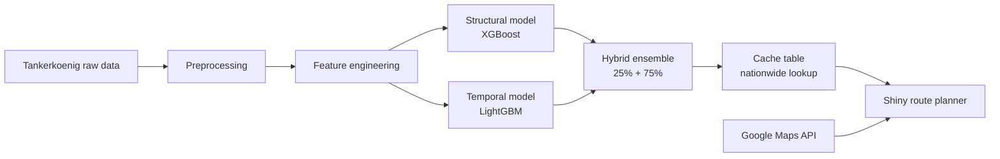
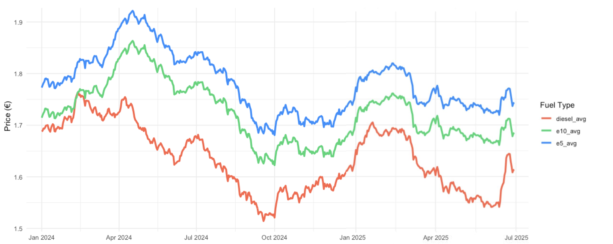
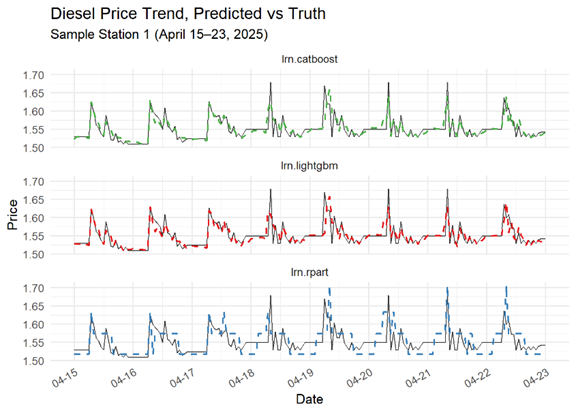
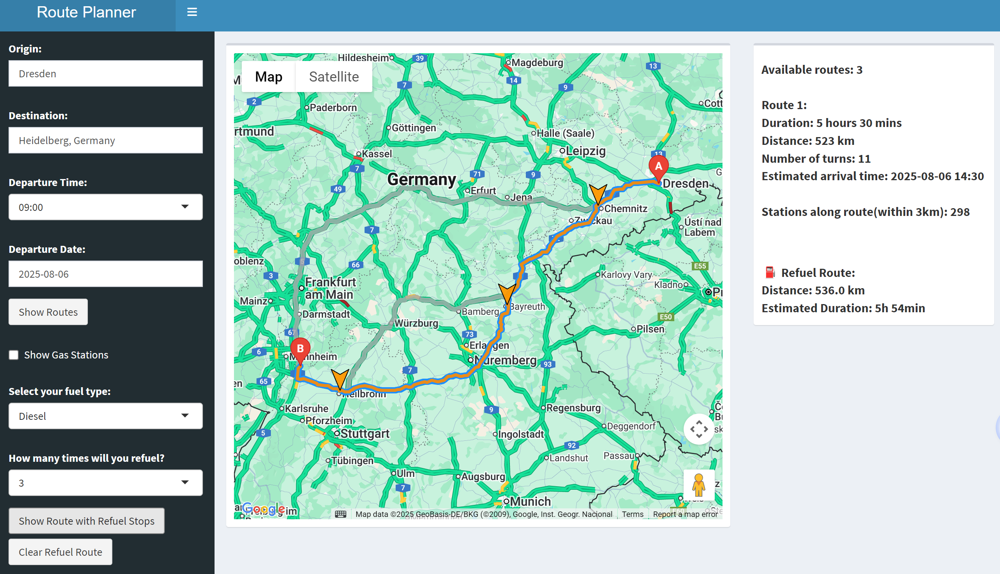
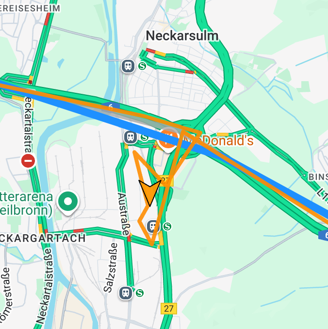
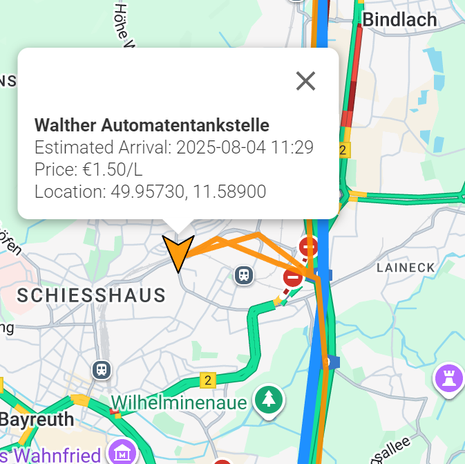
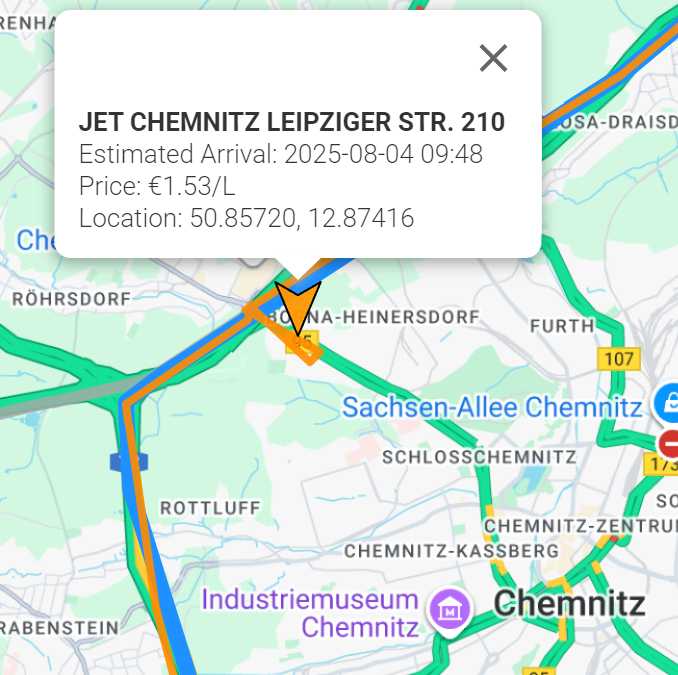

# Prediction of Gas Prices for Long-Distance Trips

> **End-to-end ML pipeline + interactive route planner** that predicts hourly fuel prices across Germany and recommends cost-optimal refueling stops along long-distance routes.

[](https://tu-dresden.de/)
[](https://github.com/bda-it)

---

## Problem & motivation

Navigation apps optimize for **time and distance**, but not **fuel cost**. Fuel prices change hourly and vary by location — the cheapest station at departure may not be cheapest at arrival.

This project closes that gap by:

1. Predicting **hourly fuel prices** at every gas station in Germany
2. Building a **hybrid ML model** combining spatial structure and temporal dynamics
3. Delivering a **Shiny route planner** that recommends refueling stops along Google Maps routes

---

## Pipeline overview



### 1. Data preprocessing

- **Source:** [Tankerkoenig dataset](https://dev.azure.com/tankerkoenig/_git/tankerkoenig-data) — all German gas stations, second-level price updates (Jan 2024 – Jun 2025)
- **Spatial features:** driving distances to nearest highway, airport, train station, and city center via [OpenRouteService](https://account.heigit.org/)
- **Temporal features:** lags (1h, 24h, 168h), rolling means (6h–168h), calendar & holiday indicators
- **Sampling:** stratified sample of **2,000 stations** (by region × brand) from ~20,000 nationwide

See [`docs/overview-of-dataset.png`](docs/overview-of-dataset.png) for the full feature schema.

### 2. Exploratory analysis

Key findings from EDA:

- **Brand effects:** Shell and AGIP ENI price higher; JET and Raiffeisen lower (consistent across Diesel, E5, E10)
- **Regional effects:** Central & Northern Germany higher; Southwest most competitive
- **Temporal patterns:** weekday prices > weekend; holiday periods show elevated prices

<p align="center">
  
</p>

### 3. Modeling

#### Structural model (XGBoost)

The structural model captures how **static station attributes** influence diesel prices — useful when recent price history is unavailable and for understanding long-run spatial pricing patterns.

**Variables modeled:**

- **Spatial distances** (`distance_m_air`, `distance_m_train`, `distance_m_highway`, `distance_m_city`): driving distances to the nearest airport, train station, highway junction, and city center. These reflect location-specific accessibility, local competition, and transport-hub effects on pricing.
- **Categorical attributes** (`brand_clean`, `region`): brand-level pricing strategies and regional market differences across Germany.
- **Coarse temporal features** (`month`, `hour`): seasonal and intra-day cycles without relying on price lags.

After benchmarking Decision Tree (RMSE 0.1184) against XGBoost (RMSE 0.0667), we selected **XGBoost** and tuned hyperparameters via Random Search. Feature selection with Information Gain removed low-contribution indicators (`is_peakhours`, `is_holiday`, `wday`, `is_weekend`), marginally improving RMSE to 0.0666.

**Interpretation — key conclusions:**

- Information Gain highlighted **month** and **spatial distances** (especially city center and train station) as top contributors.
- Permutation Importance confirmed **distance to airport** and **distance to highway junction** as the strongest spatial drivers.
- Stations farther from airports tend to charge more; stations near highway junctions tend to be cheaper.

The structural model is stable and generalizable, but tends to slightly overestimate prices and cannot track short-term fluctuations — motivating the temporal model below.

#### Temporal model (LightGBM)

The temporal model uses **lag features** (1h, 24h, 168h), **rolling means** (6h–168h), and time indicators (month, hour, weekday, holiday, peak hours) to capture short-term price dynamics.

CatBoost (RMSE 0.0164) and LightGBM (RMSE 0.0174) both outperformed Decision Tree (RMSE 0.0351). We chose **LightGBM** for further tuning due to computational efficiency on large hourly data; after removing low-importance features (`is_peakhours`, `roll_mean_72`) and hyperparameter tuning, RMSE improved to **0.0162**.

<p align="center">
  
</p>

#### Hybrid model

Neither model alone is sufficient:

- The **temporal model** is accurate but relies on lag/rolling features unavailable for unseen future timestamps, making long-horizon forecasts less stable. It also ignores station-specific attributes (brand, region, location).
- The **structural model** generalizes well across stations but has higher error and misses short-term dynamics.

We therefore combine both via a **weighted average**. To choose the blend, we defined a composite score balancing accuracy and temporal stability:

$$\text{Score} = \text{RMSE} + \lambda \cdot \text{Stability Penalty}$$

$$\text{Stability Penalty} = (1 - \mu)^2$$

where:

- **RMSE** measures predictive accuracy on the validation set
- **Stability Penalty** penalizes instability of the temporal model (quantified as prediction variance)
- **λ = 0.03** reflects a moderate stability preference, calibrated against the RMSE scales of XGBoost (0.0666) and LightGBM (0.0162) so both terms contribute meaningfully
- **μ** is the weight assigned to XGBoost in the hybrid prediction (LightGBM receives 1 − μ)

By testing different values of μ, we minimized the composite score and set the final weights to **25% XGBoost + 75% LightGBM**.

### 4. Cache table & post-prediction correction

To serve **real-time nationwide lookups** without re-running models on every query, we pre-compute hourly predictions for all stations and store them as CSV cache tables.

A systematic positive bias was corrected with a simple OLS adjustment (`Actual = a × Predicted + b`):

| Metric | Before | After |
|--------|--------|-------|
| RMSE | 0.1188 | **0.0369** |
| MAE | 0.1132 | **0.0285** |

### 5. Shiny route planner

Interactive dashboard integrating **Google Maps routing** with **predicted fuel prices**.

**Features:**

- Origin / destination selection with route alternatives
- Fuel type (Diesel, E5, E10) and number of refueling stops
- KNN-based station clustering along route + cheapest-at-arrival-time selection
- Stations within 3 km of route considered as candidates

<p align="center">
  
</p>

<p align="center">
  
  
  
</p>

When the user clicks **Show Route with Refuel Stops**, the app computes a **real refuel route** (shown in orange) that **passes through the selected stations** — not just markers on the original path. Because cheaper stations may lie slightly off the fastest route, the refuel path can be **longer in distance and duration** than the baseline route; the right panel shows both for direct comparison. Each recommended stop displays name, predicted price, and location details.

> **Note:** A live demo of the Shiny Route Planner is available below:

<p align="center">
  <video width="80%" controls>
    <source src="docs/refuel_route_planner.mp4" type="video/mp4">
    Your browser does not support the video tag.
  </video>
</p>

If the video does not display, please download it directly from:
docs/refuel_route_planner.mp4

---

## Repository structure

```
├── README.md
├── data/
│   ├── README.md                          # How to obtain full datasets
│   └── sample/2025-04-30-stations-sample.csv
├── docs/
│   ├── report.tex                         # Full project report (LaTeX source)
│   ├── refuel_route_planner.mp4           # Shiny app demo video
│   └── overview-of-dataset.png            # Feature schema overview
├── pictures/                              # Figures used in report & README
├── preprocessing/
│   ├── 00_driving_distance/               # ORS driving distance computation
│   └── 01_process_stations/               # Station metadata & stratified sampling
├── modeling/
│   └── diesel_xgb.R                       # Structural model (XGBoost benchmark, HPO, IML)
└── application/
    ├── cache_table/cache_table_test.R     # Nationwide cache table generation
    └── shiny/test.route.R                 # Interactive route planner (Shiny)
```

> **Note:** Large datasets, trained model artifacts (`.rds`), and cache tables are excluded from Git. See [`data/README.md`](data/README.md) for download and regeneration instructions.

---

## Tech stack

| Layer | Tools |
|-------|-------|
| Language | R |
| ML | mlr3, XGBoost, LightGBM, CatBoost, rpart |
| Interpretability | IML (LIME, PDP, permutation importance) |
| Geospatial | OpenRouteService, sf, geosphere |
| App | Shiny, shinydashboard, Google Maps JavaScript API |
| Data | data.table, dplyr, tidyverse |

---

## Getting started

### Prerequisites

```r
install.packages(c(
  "shiny", "shinydashboard", "shinyjs", "sf", "readr", "dplyr", "here",
  "data.table", "mlr3", "mlr3learners", "mlr3pipelines", "mlr3extralearners",
  "mlr3tuning", "mlr3filters", "openrouteservice", "geosphere", "xgboost"
))
```

### Environment variables

```bash
export ORS_API_KEY="your-openrouteservice-key"
export GOOGLE_MAPS_API_KEY="your-google-maps-key"
```

### Run the Shiny app

1. Download or regenerate cache tables and station metadata (see `data/README.md`)
2. Place CSV files in `application/shiny/`
3. Open `application/shiny/test.route.R` in RStudio and run

---

## Key results summary

| Component | Best model | RMSE | MAE |
|-----------|-----------|------|-----|
| Structural | XGBoost | 0.0666 | 0.0566 |
| Temporal | LightGBM | 0.0162 | 0.0115 |
| Hybrid | 25% XGB + 75% LGB | — | — |
| Cache table (after OLS correction) | — | 0.0369 | 0.0285 |

---

## Why this project matters

- **Real-world applicability:** directly addresses a daily pain point for long-distance drivers in Germany
- **Scalable architecture:** cache-table design enables instant lookups across ~17,000 stations × 24 hours
- **Full ML lifecycle:** from raw data ingestion and feature engineering to model interpretation, deployment, and user-facing application
- **Transport + data science:** developed at the intersection of mobility and predictive analytics

---

## References

- Tankerkoenig fuel price data: https://dev.azure.com/tankerkoenig/_git/tankerkoenig-data
- OpenRouteService API: https://account.heigit.org/
- Course materials & templates: https://github.com/bda-it

---

## License

Academic project — code provided for portfolio and educational purposes. Contact the authors for other uses.

---

## Academic context

This project was completed as part of **Methods in Data Analytics** (Summer Term 2025) at [Technische Universität Dresden (TU Dresden)](https://tu-dresden.de/), Friedrich List Faculty of Transport and Traffic Sciences, under the [Chair of Big Data Analytics in Transportation](https://tu-dresden.de/bu/verkehr/ivw/bda). Course instructor: Prof. Dr. Pascal Kerschke.

## Team

This project was jointly developed by **Ziling Song**, **Wanting Zuo**, and **Yi-Pei Yang** (listed in alphabetical order).
