# Prediction of Gas Prices for Long-Distance Trips

> **End-to-end ML pipeline + interactive route planner** that predicts hourly fuel prices across Germany and recommends cost-optimal refueling stops along long-distance routes.

[](https://tu-dresden.de/)
[](https://github.com/bda-it)

---

## Academic context

| | |
|---|---|
| **University** | [Technische Universität Dresden (TU Dresden)](https://tu-dresden.de/) |
| **Faculty** | Friedrich List Faculty of Transport and Traffic Sciences |
| **Chair** | [Chair of Big Data Analytics in Transportation](https://tu-dresden.de/bu/verkehr/ivw/bda) |
| **Course** | Methods in Data Analytics *(Applications in Data Analytics)* — Summer Term 2025 |
| **Instructor** | Prof. Dr. Pascal Kerschke |

### Team

| Name | Role |
|------|------|
| **Wanting Zuo** | Data preprocessing, modeling |
| **Ziling Song** | Modeling, cache table, Shiny application |
| **Yi-Pei Yang** | EDA, structural & temporal models |

---

## Problem & motivation

Navigation apps optimize for **time and distance**, but not **fuel cost**. Fuel prices change hourly and vary by location — the cheapest station at departure may not be cheapest at arrival.

This project closes that gap by:

1. Predicting **hourly fuel prices** at every gas station in Germany
2. Building a **hybrid ML model** combining spatial structure and temporal dynamics
3. Delivering a **Shiny route planner** that recommends refueling stops along Google Maps routes

---

## Pipeline overview

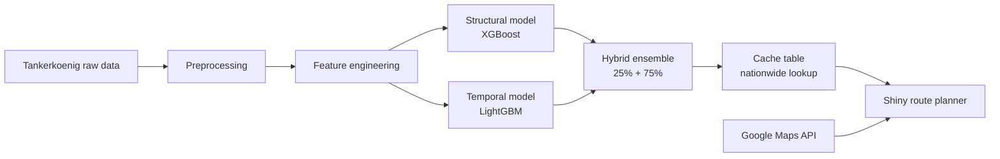

### 1. Data preprocessing

- **Source:** [Tankerkoenig dataset](https://dev.azure.com/tankerkoenig/_git/tankerkoenig-data) — all German gas stations, second-level price updates (Jan 2024 – Jun 2025)
- **Spatial features:** driving distances to nearest highway, airport, train station, and city center via [OpenRouteService](https://account.heigit.org/)
- **Temporal features:** lags (1h, 24h, 168h), rolling means (6h–168h), calendar & holiday indicators
- **Sampling:** stratified sample of **2,000 stations** (by region × brand) from ~20,000 nationwide

See [`docs/overview-of-dataset.png`](docs/overview-of-dataset.png) for the full feature schema.

### 2. Exploratory analysis

Key findings from EDA:

- **Brand effects:** Shell and AGIP ENI price higher; JET and Raiffeisen lower (consistent across Diesel, E5, E10)
- **Regional effects:** Central & Northern Germany higher; Southwest most competitive
- **Temporal patterns:** weekday prices > weekend; holiday periods show elevated prices

<p align="center">
  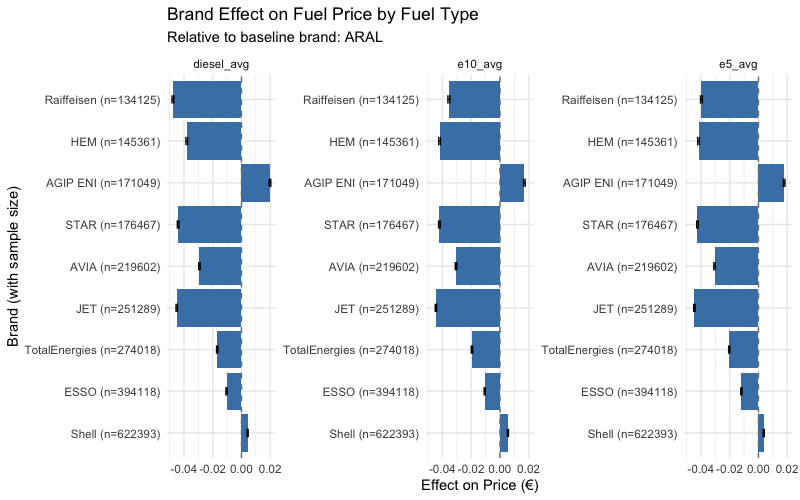
  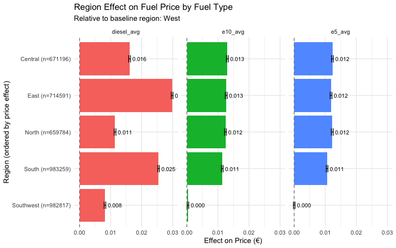
</p>

<p align="center">
  
</p>

### 3. Modeling

#### Structural model (XGBoost)

Uses static station attributes: brand, region, distances to POIs, month, hour.

| Model | RMSE | MAE |
|-------|------|-----|
| Decision Tree | 0.1184 | 0.0988 |
| **XGBoost** | **0.0667** | **0.0566** |

<p align="center">
  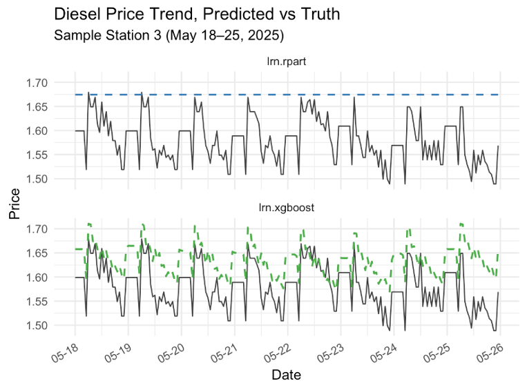
</p>

Feature importance (Information Gain & Permutation Importance):

<p align="center">
  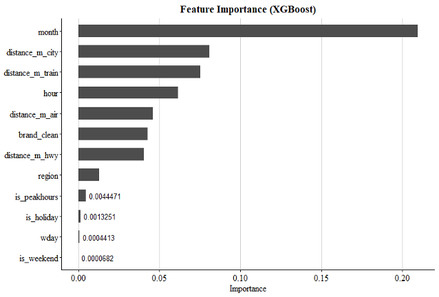
  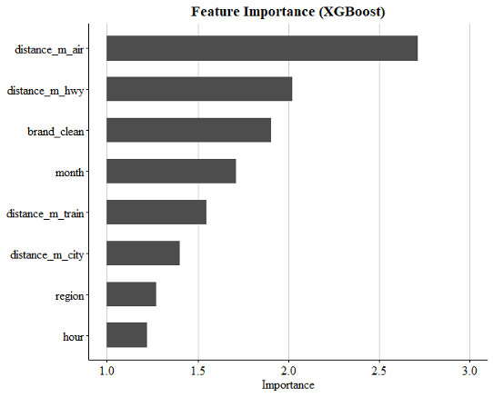
</p>

Spatial pricing patterns (PDP / ICE):

<p align="center">
  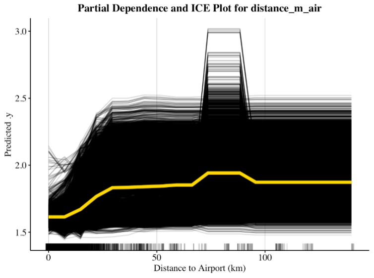
  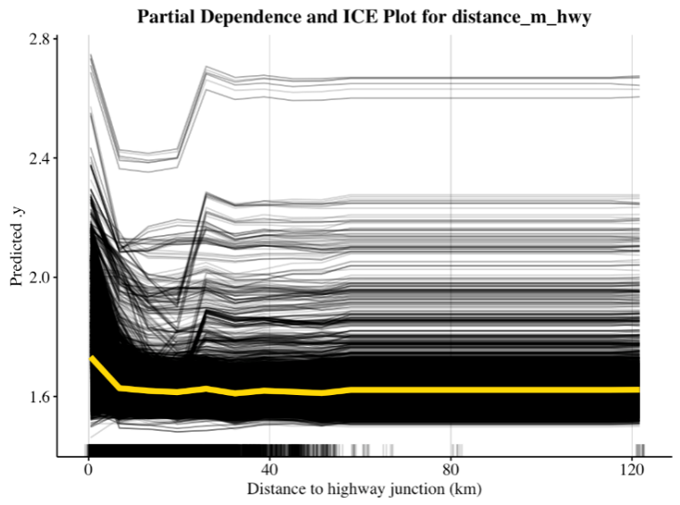
</p>

#### Temporal model (LightGBM)

Uses lag features, rolling means, and time indicators for short-term dynamics.

| Model | RMSE | MAE |
|-------|------|-----|
| Decision Tree | 0.0351 | 0.0277 |
| CatBoost | 0.0164 | 0.0111 |
| **LightGBM (tuned)** | **0.0162** | **0.0115** |

<p align="center">
  
  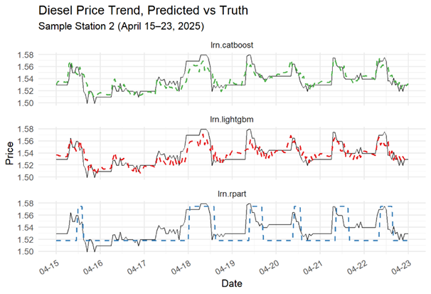
</p>

#### Hybrid model

Weighted ensemble: **25% XGBoost + 75% LightGBM**, optimized with a stability-aware score (λ = 0.03).

<p align="center">
  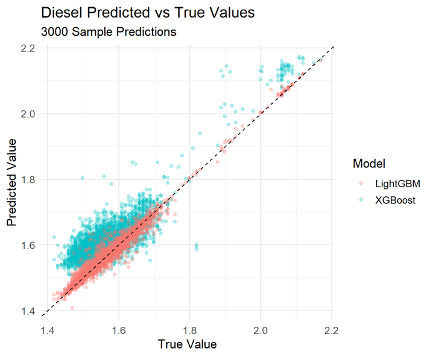
  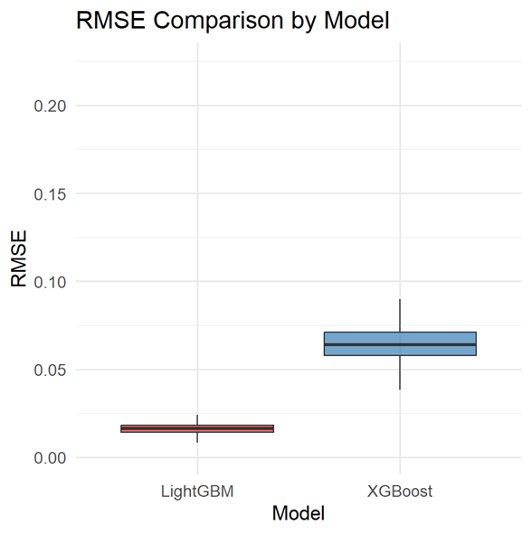
</p>

### 4. Cache table & post-prediction correction

To serve **real-time nationwide lookups** without re-running models on every query, we pre-compute hourly predictions for all stations and store them as CSV cache tables.

A systematic positive bias was corrected with a simple OLS adjustment (`Actual = a × Predicted + b`):

| Metric | Before | After |
|--------|--------|-------|
| RMSE | 0.1188 | **0.0369** |
| MAE | 0.1132 | **0.0285** |

### 5. Shiny route planner

Interactive dashboard integrating **Google Maps routing** with **predicted fuel prices**.

**Features:**
- Origin / destination selection with route alternatives
- Fuel type (Diesel, E5, E10) and number of refueling stops
- KNN-based station clustering along route + cheapest-at-arrival-time selection
- Stations within 3 km of route considered as candidates

<p align="center">
  
</p>

<p align="center">
  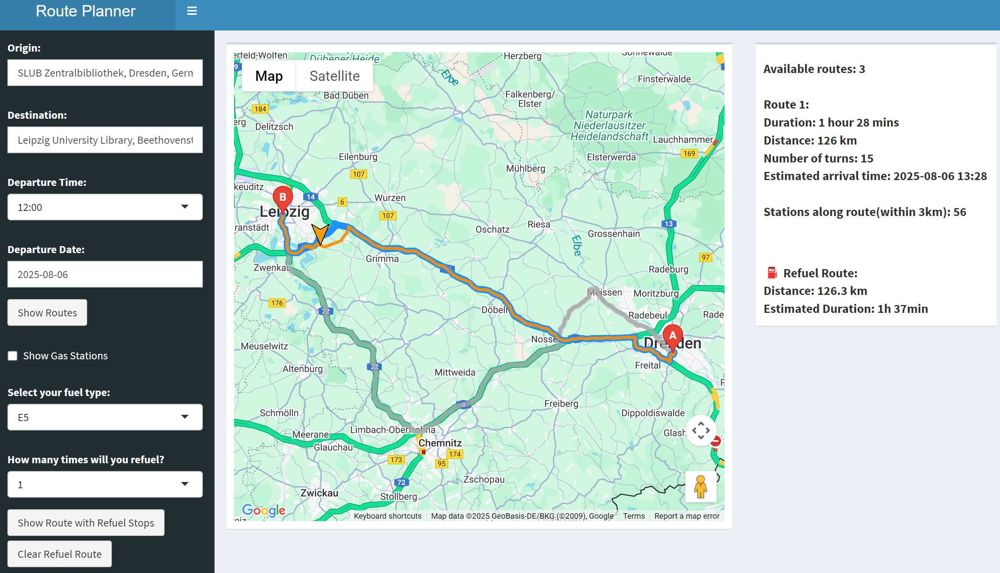
</p>

**Refueling recommendations** (Dresden → Heidelberg, 3 stops):

<p align="center">
  
  
  
</p>

---

## Repository structure

```
├── README.md
├── data/
│   ├── README.md                          # How to obtain full datasets
│   └── sample/2025-04-30-stations-sample.csv
├── docs/
│   ├── report.tex                         # Full project report (LaTeX source)
│   └── overview-of-dataset.png            # Feature schema overview
├── pictures/                              # All figures used in report & README
├── preprocessing/
│   ├── 00_driving_distance/               # ORS driving distance computation
│   └── 01_process_stations/               # Station metadata & stratified sampling
├── modeling/
│   └── diesel_xgb.R                       # Structural model (XGBoost benchmark, HPO, IML)
└── application/
    ├── cache_table/cache_table_test.R     # Nationwide cache table generation
    └── shiny/test.route.R                 # Interactive route planner (Shiny)
```

> **Note:** Large datasets, trained model artifacts (`.rds`), and cache tables are excluded from Git. See [`data/README.md`](data/README.md) for download and regeneration instructions.

---

## Tech stack

| Layer | Tools |
|-------|-------|
| Language | R |
| ML | mlr3, XGBoost, LightGBM, CatBoost, rpart |
| Interpretability | IML (LIME, PDP, permutation importance) |
| Geospatial | OpenRouteService, sf, geosphere |
| App | Shiny, shinydashboard, Google Maps JavaScript API |
| Data | data.table, dplyr, tidyverse |

---

## Getting started

### Prerequisites

```r
install.packages(c(
  "shiny", "shinydashboard", "shinyjs", "sf", "readr", "dplyr", "here",
  "data.table", "mlr3", "mlr3learners", "mlr3pipelines", "mlr3extralearners",
  "mlr3tuning", "mlr3filters", "openrouteservice", "geosphere", "xgboost"
))
```

### Environment variables

```bash
export ORS_API_KEY="your-openrouteservice-key"
export GOOGLE_MAPS_API_KEY="your-google-maps-key"
```

### Run the Shiny app

1. Download or regenerate cache tables and station metadata (see `data/README.md`)
2. Place CSV files in `application/shiny/`
3. Open `application/shiny/test.route.R` in RStudio and run

---

## Key results summary

| Component | Best model | RMSE | MAE |
|-----------|-----------|------|-----|
| Structural | XGBoost | 0.0666 | 0.0566 |
| Temporal | LightGBM | 0.0162 | 0.0115 |
| Hybrid | 25% XGB + 75% LGB | — | — |
| Cache table (after OLS correction) | — | 0.0369 | 0.0285 |

---

## Why this project matters

- **Real-world applicability:** directly addresses a daily pain point for long-distance drivers in Germany
- **Scalable architecture:** cache-table design enables instant lookups across ~17,000 stations × 24 hours
- **Full ML lifecycle:** from raw data ingestion and feature engineering to model interpretation, deployment, and user-facing application
- **Transport + data science:** developed at the intersection of mobility and predictive analytics

---

## References

- Tankerkoenig fuel price data: https://dev.azure.com/tankerkoenig/_git/tankerkoenig-data
- OpenRouteService API: https://account.heigit.org/
- Course materials & templates: https://github.com/bda-it

---

## License

Academic project — code provided for portfolio and educational purposes. Contact the authors for other uses.
